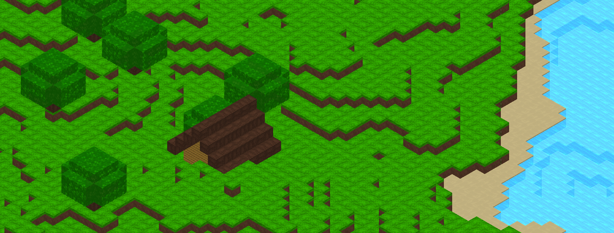



# Minecraft Clone

This is my own Minecraft Clone, a personal project where I attempt to create my own first game engine. This is a for-fun project that I work on in my free time.

## Features
- 🖌️ Custom Textures
- 🌍 Infinite World Generation
- 🏢 Structure Generation
- 💡 Basic Lighting System
- 🕑 World Tick System
- 💾 World Saving
- 📸 Screenshotting
- 🏜️ Biomes

## Controls
| Keybind        | Action                          | Notes                     |
| -------------- | ------------------------------- | ------------------------- |
| `F`            | Fly                             |                           |
| `Left Control` | Sprint                          |                           |
| `/ + Q`        | Toggle 3D Rendering             |                           |
| `/ + U`        | Reload Assets                   |                           |
| `/ + I`        | Save World                      |                           |
| `F1`           | Toggle GUI                      |                           |
| `F3`           | Debug Menu                      | Click twice for more info |
| `F11`          | Full Screen                     |                           |
| `F4`           | Debug Camera                    | Only in debug builds      |
| `C`            | Teleport to Debug Camera        | Only in debug builds      |

## Startup Flags
| Flag                            | Description                                                |
| ------------------------------- | ---------------------------------------------------------- |
| `--max-memory <memory in MBs>`  | Change max game memory                                     |
| `--load-library <library path>` | Load a library such as [RenderDoc](https://renderdoc.org/) |
| `--no-sound`                    | Disable sounds                                             |
| `--world <world name>`          | Load a world                                               |
| `--world NEW_WORLD`             | Load a new world                                           |
| `--world DEBUG_WORLD`           | Load the debug world. Only in debug builds                 |
| `--world TEMP_WORLD`            | Load a temporary world                                     |

## Building on Windows
### Requirements
- Visual Studio 2022
- Desktop development with C++

## Building on Linux
To build the game on Linux, you need to run the following commands:
```sh
apt install build-essential
make build
make run
```

## Contributing
I appreciate the fact that you may want to contribute to this project; however, I'm not accepting contributions at this time.\
Please **do not** open any pull requests, as they'll get ignored or closed.

## License
This project is licensed under the [MIT License](LICENSE.md).

## Acknowledgements
- Inspired by the original game: [Minecraft](https://minecraft.net)
- Thanks to the [Open Source](https://opensource.org/) community for the libraries and tools used in this project
